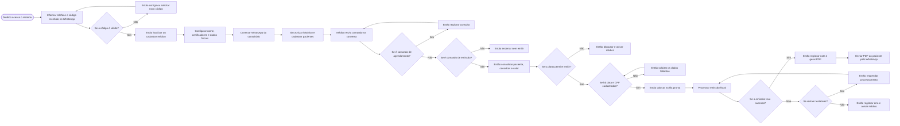
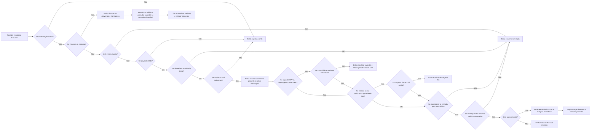
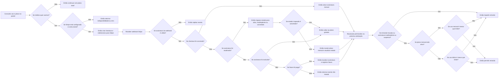

# Notomed Whats — análise e fluxogramas

Análise do código local em 30/09/2026. Os diagramas representam os processos implementados em `src`, na interface web, nos adaptadores e no esquema SQL. Não houve acesso aos serviços em produção. Planos em Markdown e tabelas do banco não foram considerados prova de funcionalidades operacionais.

Todos os fluxogramas seguem da esquerda para a direita. **Se** introduz uma condição, **sim/não** identificam suas saídas e **então** indica a ação decorrente.

## 1. Visão geral

## 2. Acesso e configuração inicial

```mermaid
flowchart LR
 A[Informar telefone] --> B{Se telefone válido e reenvio permitido?}
 B -->|Não| C[Então mostrar erro ou aguardar intervalo]
 C --> A
 B -->|Sim| D[Então salvar hash do código e enviar WhatsApp]
 D --> E{Se o envio teve sucesso?}
 E -->|Não| F[Então retornar falha de envio]
 E -->|Sim| G[Informar código]
 G --> H{Se código confere, não expirou e não está bloqueado?}
 H -->|Não| I[Então retornar motivo e contar tentativa se incorreto]
 I --> G
 H -->|Sim| J{Se usuário já existe?}
 J -->|Não| K[Então criar usuário, conta e médico]
 J -->|Sim| L[Então recuperar cadastro]
 K --> M[Gerar dados de acesso e abrir configuração]
 L --> M
 M --> N[Salvar nome do médico]
 N --> O[Enviar certificado A1 e senha]
 O --> P{Se certificado abre e não está vencido?}
 P -->|Não| Q[Então solicitar correção]
 Q --> O
 P -->|Sim| R[Então armazenar certificado e buscar última nota no ADN]
 R --> S{Se foi possível importar a nota?}
 S -->|Não| T[Então enviar XML de referência manualmente]
 S -->|Sim| U[Então extrair perfil e serviço fiscal]
 T --> U
 U --> V[Revisar e confirmar parâmetros fiscais]
 V --> W[Conectar WhatsApp por QR ou código de pareamento]
 W --> X{Se nome, fiscal confirmado, certificado ativo e WhatsApp conectado?}
 X -->|Não| Y[Então manter etapas pendentes]
 Y --> M
 X -->|Sim| Z[Então exibir painel e sincronizar histórico]
```

O checklist controla a apresentação do painel. O comando de emissão não repete integralmente esse checklist; o emissor verifica perfil fiscal, CPF e certificado no momento do processamento.

## 3. Mensagens, histórico e agendamento

Na emissão, a busca de dados faltantes usa até 20 mensagens recentes. No comando de agendamento, o webhook passa o texto do próprio comando para a extração. Mensagens comuns são armazenadas antes de terminar sem disparar comandos. Grupos e mensagens sem telefone/texto utilizável não seguem para esse cadastro.

## 4. Preparação da emissão e resolução de pendências

```mermaid
flowchart LR
 A[Receber comando de emissão] --> B{Se conversa tem médico associado?}
 B -->|Não| C[Então retornar médico não encontrado]
 B -->|Sim| D[Então localizar ou criar paciente e buscar consultas em aberto]
 D --> E[Calcular valor pelo comando ou pelas consultas]
 E --> F{Se faltam CPF, consulta ou valor e há IA e histórico?}
 F -->|Sim| G[Então extrair dados e atualizar cadastro ou agendamento]
 F -->|Não| H{Se valor está disponível?}
 G --> H
 H -->|Não| I[Então retornar valor indisponível]
 H -->|Sim| J{Se cadastro do médico foi encontrado?}
 J -->|Não| C
 J -->|Sim| K{Se trava, assinatura e limites permitem emissão?}
 K -->|Não| L[Então avisar médico e encerrar]
 K -->|Sim| M[Então criar solicitação e vincular consultas]
 M --> N{Se há consulta registrada?}
 N -->|Não| O[Então manter fila vazia e perguntar data ao médico]
 N -->|Sim| P{Se paciente tem CPF cadastrado?}
 O --> Q{Se paciente tem CPF cadastrado?}
 Q -->|Não| R[Então pedir CPF ao paciente também]
 Q -->|Sim| S[Aguardar resposta do médico]
 R --> S
 S --> T{Se resposta do médico é texto não vazio?}
 T -->|Não| S
 T -->|Sim| U[Então atualizar descrição e remover pendência de data]
 U --> P
 P -->|Sim| V[Então fila pronta para processamento]
 P -->|Não| W[Então fila pendente de cadastro e pedir CPF]
 W --> X{Se chegou CPF válido?}
 X -->|Não| Y[Então manter pendência]
 Y --> X
 X -->|Sim| Z[Então atualizar paciente e liberar fila sem pendência de data]
 Z --> V
```

Data e CPF podem faltar ao mesmo tempo. Receber CPF não libera uma solicitação que ainda aguarda data. A resposta de data altera a descrição, mas não cria um agendamento nesse caminho.

## 5. Fila, emissão fiscal e entrega

```mermaid
flowchart LR
 A[Worker consulta solicitações] --> B{Se há item pronto, vencimento da tentativa atingido e lock disponível?}
 B -->|Não| C[Então aguardar 5 segundos]
 C --> A
 B -->|Sim| D[Então bloquear item para o worker]
 D --> E{Se existem perfil fiscal e CPF do paciente?}
 E -->|Não| F[Então tratar falha]
 E -->|Sim| G[Então consultar nome civil se possível e definir número DPS]
 G --> H{Se clientes Supabase e SEFIN estão disponíveis?}
 H -->|Não| I[Então executar modo de simulação local]
 H -->|Sim| J{Se certificado ativo pode ser carregado e aberto?}
 J -->|Não| F
 J -->|Sim| K[Então gerar XML DPS, assinar e transmitir à SEFIN]
 K --> L{Se transmissão autorizada?}
 L -->|Não| M{Se erro de numeração duplicada ou enquadramento MEI corrigível?}
 M -->|Sim| N{Se restam ajustes internos?}
 N -->|Sim| O[Então avançar número ou ajustar perfil para MEI]
 O --> K
 N -->|Não| F
 M -->|Não| F
 L -->|Sim| P[Então obter chave e XML autorizado]
 P --> Q{Se conversão MeuDanfe produz PDF?}
 I --> Q
 Q -->|Não| R[Então gerar PDF pelo gerador interno]
 Q -->|Sim| S[Então usar PDF convertido]
 R --> T[Tentar armazenar XML e preparar PDF]
 S --> T
 T --> U[Registrar nota e marcar solicitação emitida em transação]
 U --> V{Se existe contexto de envio?}
 V -->|Não| W[Então finalizar sem enviar PDF]
 V -->|Sim| X[Então tentar enviar PDF pelo WhatsApp]
 X --> Y{Se envio lança exceção?}
 Y -->|Não| Z([Processamento concluído])
 Y -->|Sim| AA[Então registrar alerta técnico]
 AA --> F
 F --> AB{Se a falha foi exceção inesperada?}
 AB -->|Sim| AC[Então registrar alerta técnico]
 AB -->|Não| AD{Se atingiu 3 tentativas?}
 AC --> AD
 AD -->|Sim| AE[Então marcar erro definitivo e avisar médico]
 AD -->|Não| AF[Então reagendar com espera de 60 ou 120 segundos]
 AF --> A
```

Os ajustes internos de sequência/MEI admitem até seis transmissões dentro de uma chamada ao emissor. As três tentativas do worker são um limite separado. O lock fica recuperável após cinco minutos. O PDF é retornado em base64, enquanto o XML autorizado pode ser enviado ao Storage.

## 6. Plano, assinatura e cobrança

Os limites padrão codificados são cinco notas/dia no gratuito e cem notas/mês no mensal; valores configurados no banco podem substituí-los. O portal Stripe é aberto pela API quando há cliente vinculado. O preço efetivo depende do identificador de preço configurado na Stripe.

## Arquitetura e abrangência

| Componente | Responsabilidade implementada |
|---|---|
| Interface web | Telefone/OTP, etapas de configuração, painel de uso, checkout e portal |
| Servidor Express | Interface, APIs, webhooks Evolution/Stripe, consulta CPF, extração IA, geração avulsa de PDF e healthcheck |
| PostgreSQL | Contas, usuários, médicos, perfil fiscal, certificado, mensagens, pacientes, agendamentos, solicitações, notas e cobrança |
| Supabase | Administração de usuários, geração de links de acesso e armazenamento de arquivos |
| Evolution | Código OTP, conexão do WhatsApp, histórico, mensagens e PDF |
| NVIDIA | Extração de dados com regras locais de fallback |
| Hub do Desenvolvedor | Consulta cadastral opcional a partir de CPF |
| ADN | Busca da NFS-e anterior para importar parâmetros fiscais |
| SEFIN | Recepção da DPS assinada e autorização fiscal |
| MeuDanfe / gerador interno | Conversão do XML em PDF, com fallback interno |
| Worker | Seleção exclusiva de itens, emissão, persistência, entrega e retentativas |

O servidor inicia um worker embutido. Também existe um processo independente de worker. O mecanismo de lock permite consumidores concorrentes. O esquema contém secretarias, contadores, pagamentos, agenda de horários, consentimentos e auditoria, mas não há fluxos completos desses recursos expostos pela aplicação principal examinada. Cancelamento/substituição fiscal e conciliação automática de pagamentos não aparecem como processos operacionais implementados em `src/server.ts`.

## Diferenças e limitações observadas

1. **Autorização das APIs:** as rotas de configuração, consulta CPF, IA e billing examinadas não validam token de sessão nem propriedade do `medicoId` por middleware. Várias acessam o banco diretamente pelo pool. A presença de políticas RLS no esquema não comprova proteção dessas rotas.
2. **Dados de acesso:** `gerarSessaoParaUsuario` retorna `hashed_token` de um link mágico ou um texto `sessao_...`; não realiza nesse método a troca por uma sessão com access token. A interface guarda esse resultado localmente e chama as APIs sem cabeçalho de autenticação.
3. **Webhook Evolution:** o servidor aceita alternativas ao segredo configurado, inclusive uma credencial literal no código. O fluxograma registra a aceitação atual, sem pressupor autenticação exclusivamente por segredo dedicado.
4. **Data da consulta:** qualquer texto não vazio pode ser aceito como data da solicitação pendente mais recente do médico. Não há validação de formato/calendário ou seleção explícita da solicitação nesse caminho.
5. **Simulação fiscal:** sem os clientes necessários, o emissor gera uma chave local e retorna sucesso; o repositório registra `autorizada` e `emitida`. Esse caminho não significa autorização real da SEFIN.
6. **Entrega após persistência:** a nota é gravada antes do envio do PDF. Uma exceção de envio entra no tratamento de falha da emissão, mas a solicitação já está `emitida`, estado excluído da seleção do worker. Não há fila específica de reenvio no fluxo examinado.
7. **Alerta por e-mail:** os workers têm uma função com esse nome, mas sua implementação apenas escreve no log quando a configuração existe; não envia e-mail.
8. **Limites:** a permissão é verificada ao criar a solicitação; não há reserva atômica de cota nem nova verificação de billing pelo worker. Pedidos concorrentes podem exigir proteção adicional contra ultrapassagem de limite.
9. **Persistência fiscal:** o upload do XML não é uma condição obrigatória de sucesso. O PDF é guardado como data URI no campo chamado `pdf_storage_path`. Valores fiscais do PDF incluem defaults no código; a fidelidade aos valores autorizados requer revisão própria.

Esses pontos são observações do código, não resultados de exploração do ambiente de produção. Nenhuma correção funcional foi aplicada nesta tarefa.

## Verificação e fontes

Foi tentada a suíte de testes existente. Ela não conseguiu iniciar normalmente: o runtime retornou `uv_os_get_passwd ENOMEM` ao carregar `tsx`. Portanto, esta entrega se baseia em análise estática; não há confirmação de funcionamento integrado em produção.

Fontes principais: `src/server.ts`, `src/ui/index.html`, `src/auth`, `src/otp`, `src/onboarding`, `src/fluxos`, `src/billing`, `src/worker`, `src/io/postgres`, `src/io/fiscal`, `src/io/supabase`, `src/fiscal/danfse`, `schema_nf_saude.sql` e `Dockerfile`. Os diretórios `emissor-nfse` e `emissor-nfse-upstream` não são os pontos de entrada declarados no pacote principal; o fluxo fiscal operacional foi rastreado pelos imports de `src`.
